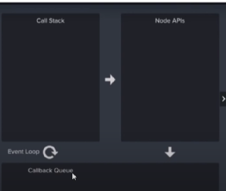

<br><br>

<h1 align="center">NODE JS</h1>

## ABOUT NODE 

<details>
<summary>click</summary>
<br>
1.Node js runs on v8 engine<br>
2.node.js app runs in a single process without creating new thread for every request<br>
3.node js provide a set of asynchronous input-output primitives<br>
4.node js handle thousand of concurrent connection with a single server<br>
5.server is set to listem on the specified port and host name<br>
6.node is not a programing language<br>
7.this is server environment<br>
8.node js can connect with database<br>
9.code and syntax very similar to javascript But not exactly the same<br>
10.Node js free,open source<br>
11.node js mostly used for API<br>
12.So we can connect the same database with web App,mobile App<br>
13.Node js is easy to understand who knows Javascript<br>
14.node is super-fast for Api<br>
15.with Node and Javascript you can become full stack developer<br>
16.node written in c,c++,javascript<br>
17.Node js runs on the server side <br>
18.javascript runs in browser  <br>
</details>

## WHAT DEVELOPER MAKE WITH NODE JS

<details>
<summary>CLICK</summary>
<br>
1.DEVELOPER MAKE API WITH NODE JS<br>
2.SO WE CAN CONNECT SERVER WITH CLIENT<br>
3.NODE CAN MAKE API FOR WEB ,ANDROID AND IOS<br>
</details>

## About npm

npm is a package manager for the JavaScript programming language maintained by npm, Inc. npm is the default package manager for the JavaScript runtime environment Node.js. It consists of a command line client, also called npm, and an online database of public and paid-for private packages, called the npm registry.

## HOW TO INSTALL NODE JS
[CLICK ON THE LINK TO DOWNLOAD NODEJS](https://nodejs.org/dist/v16.14.2/node-v16.14.2-x64.msi)

OPEN CMD AND CHECK ITS VERSION<BR>
TYPE
```
node -v
```
```
output:
v16.14.2
```
output may be different in your case.
## How to make export file

<details>
<summary>CLICK</summary>

```

module.exports={
    x:10,
    y:20,
    z:function(){
        return 10;
    }
}
```
</details>

## How to import external module

  
<details>
<summary>CLICK</summary>


```
const variable_name=require('module_name')
```
</details>

## How to run node file using terminal<br>

```
node .\filename.js
```


---
**INTERVIEW QUESTION**

Q.) WHY WE USE FILTER FUNCTION ?<BR>
ANS)IF WE WANT TO FIND SPECIFIC VALUE FROM THE ARRAY THEN WE USE FILTER FUNCTION

```
const arr=[1,2,3,4,5,6,3,2,1]

let result=arr.filter((item)=>{
return item>4
})

console.log(result)
```
```
OUTPUT:

[ 5, 6 ]
```
---

## core modules
modules which are installed which the node js

## global modules

These are the modules which do not need to import
<br><br>

# Package.json
It stores coding related file

The package. json file is the heart of any Node project. It records important metadata about a project which is required before publishing to NPM, and also defines functional attributes of a project that npm uses to install dependencies, run scripts, and identify the entry point to our package<br>
[source](https://heynode.com/tutorial/what-packagejson/#:~:text=Recap-,The%20package.,entry%20point%20to%20our%20package.)

### How to add package.json

```
npm init
```
Package.json is very important file for project

---
**INTERVIEW QUESTION**

Q.) Node js is single thread or multi thread?<BR>
ANS)single thread,
Node.js is asynchronous and single-threaded. This means that all I/O operations don’t block any other operations. It also means that you can send emails, read files, query the database, etc. all at the same time.
Each request to the web-server won’t create a separate Node.js process. Although, one Node.js process would run at all times which would listen to the connections. JavaScript code is also executed in the process’ main thread while all other I/O operations are executed in separate threads which results in almost no delays.
The virtual machine in Node.js (V8) which is responsible for executing JavaScript consists of a JIT compilation. The virtual machine can take the source code to compile it into the machine code at runtime. What it means is that all the “hot” functions that get called often than not can be compiled to the machine code thus boosting the execution speed.<br>
[source](https://www.peerbits.com/blog/why-nodejs-fast-and-its-best-use-cases.html)

<br>

Q)When you mistakely delete node_modules,How to recover them<br>

```
npm install
```
because in package.json there are dependencies are available when we run this command then all dependencies got installed. 

---

### HOW TO AVOID PUSHING NODE_MODULE IN GIT HUB 
 MAKE **.gitignore** file and write **/node_modules** in that file
<br>

# NODEMON/Time saving module
Nodemon continuously runs the node.js project

Nodemon is a tool that helps develop node. js based applications by automatically restarting the node application when file changes in the directory are detected. nodemon does not require any additional changes to your code or method of development. nodemon is a replacement wrapper for node
[source](https://www.npmjs.com/package//nodemon#:~:text=nodemon%20is%20a%20tool%20that,a%20replacement%20wrapper%20for%20node%20.)

## how to install nodemon

```
npm install nodemon -g
```
### How to run project
```
nodemon filename.js
```

# Make a simple API with static data

```
const http=require('http');
const { json } = require('stream/consumers');
http.createServer((req,res)=>{
res.writeHead(200,{'Content-Type':'application\json'});
res.write(JSON.stringify({name:"harsh",email:"harsh@test.com"}))
res.end()

}).listen(5000)

```
Another method using export and import module

```
export module:

-------------------------------------------
const data=[
    {name:"harsh",email:"harsh@test.com"},
    {name:"arav",email:"arav@test.com"},
    {name:"abhi",email:"abhi@test.com"}
]
module.exports=data;
-------------------------------------------
```
```
import module:

---------------------------------------------
const http=require('http');
const data=require('./data(node5)')
const { json } = require('stream/consumers');
http.createServer((req,res)=>{
res.writeHead(200,{'Content-Type':'application\json'});
res.write(JSON.stringify(data))
res.end()

}).listen(5000)

---------------------------------------------

```

## HTTP status code

[HTTP status code](https://moz.com/learn/seo/http-status-codes#:~:text=An%20HTTP%20status%20code%20is,code%3A%20the%20HTTP%20status%20code.)

## How to create file in specific folder

1.Import file module<br>
2.import path module<br>
3.fetch folder address using *path.join*<br>
4.then create file using writeFileSync <br>
```
const fs=require('fs')
const path=require("path")
const dirPath=path.join(__dirname,'crud')
const filepath=`${dirPath}/HARSH.txt`
fs.writeFileSync(filepath,"i am harsh")

``` 

## how to read file

```
fs.readFile(filepath,'utf8',(err,item)=>{
 console.log(item)
})
```

## How to append file

```
fs.appendFile(filepath,"AND file name is HArsh .txt",(err)=>{
if(!err)
{
console.log('file is updated')
}
})

```

## how to remame file
```

fs.rename(filepath,`${dirPath}/fruit.txt`,(err)=>
{
    if(!err)
    {
        console.log("file name is updated")
    }
})
```
## how to delete file

```

fs.unlinkSync(`${dirPath}/fruit.txt`)
```
---
**Interview Question**

Q) when we run the code without *utf8* in output it shows buffer why?

ANS) Buffer simply means temporary memory location.when we create file the node js want some memory so that it can perform operation.

---

## Synchronous
In Synchronous operations tasks are performed one at a time


## Asynchronous
In Asynchronous,Second Task do not wait to finish First Task


## Check Asynchronous
when you run this code you can see that loginc.. runs after 2 sec but it does not wait for it and runs complete exe...
```
console.log("start exe...")

setTimeout(() => {
    console.log("loginc...")
}, 2000);

console.log("complete exe...")
``` 

### DrawBack of Asynchronous
when you run this code it print 10 but the answer is 30 because b take time to execute so it print last statement.
we handle this using callback and promises
```
let a=10;
let b=0;

setTimeout(() => {
    b=20;
}, 2000);

console.log(a+b)


```
# Handle Asynchronous Data in Node js

## using Promise

If it is a complex program and give late result keep it in a promise when it resolve the result got updated.<br>
we pass teo paramter resolve and reject.<br>


```
let a=10;
let b=0;

let waititngData=new Promise((resolve,reject)=>{
    setTimeout(() => {
        resolve(20)
    }, 2000);
})

waititngData.then((data)=>{
    b=data;
    console.log(a+b)
})
 
```

# How NODE JS work

There is some process going on in between when code runs and output display




### call stack
When we run the code By default *main{}* function got register in it and after it each and every function present in the code got register.
when the function is executed fully it comes out from the stack and in last *main{}* function comes out from the stack.


## NODE API and CALLBACK QUEUE

The function which are inherit from  c and c++ 
they went to NODE API at the time of execution.
<br>
example:*SetTimeout*
<br>

REFER THIS CODE TO UNDERSTAND EXECUTIION
```
console.log("starting up..")

setTimeout(() => {
    console.log("2 second log")
}, 2000);

setTimeout(() => {
    console.log("0 second log")
}, 0);

console.log("finishing up")
```
```
output:

starting up..
finishing up
0 second log
2 second log
```

<br>

<br>
The SetTimeout function which take the less time go into callback queue because NODE API want empty stack so it wait till the stack is not going to empty.

<br>
Finally went stack is empty setTimeout enter in the stack
<br>


<br><br>

<br><br>

# ABOUT EXPRESS JS

Express is a minimal and flexible Node.js web application framework that provides a robust set of features for web and mobile applications.

[SOURCE](https://expressjs.com/)

## How to install Express
```
npm install express
```

## How to do routing using express
app.get(), on the other hand, is part of Express' application routing and is intended for matching and handling a specific route when requested with the GET HTTP verb:
* GET /
```
const express= require('express')
const app=express()

app.get('',(req,res)=>{
  res.send("hello, this is home page")
})

app.get('/about',(req,res)=>{
    res.send("hello, this is aout page")
  })

  app.listen(5000)
```

## ROUTING
 
 #### WHAT IS req,res

 REQUEST:-If data came from client side then it is gone in request parameter.

 RESPONSE:- If data send by us then it  goes in response parameter
 
<br><br>

* RESPONSE EXAMPLE

 ```
 app.get('',(req,res)=>{
  res.send("hello, this is home page")
})
 ```

 * REQUEST EXAMPLE

```
how to get this request of client

http://localhost:5000/?name=%22harsh%22
```
```
app.get('',(req,res)=>{
    console.log("data sent by browser",req.query.name)
  res.send("hello "+ req.query.name)
})
```

## HOw to render HTML Data

```
app.get('/about',(req,res)=>{
    res.send(`
    <input type="text" placeholder="user name"/>
    <button>submit</button>
    `
    )
  })
  app.get('/help',(req,res)=>{
    res.send("hello, this is hrlp page")
  })
```

## How to show JSON data

```
 app.get('/help',(req,res)=>{
    res.send(
        [
        {
        name:'anil',
        email:'anil@test.com'
        },
        {
    name:'harsh',
    email:'harsh@test.com'
        }
        ]
)
  })
```

## How to link pages

```
app.get('',(req,res)=>{
  res.send(`
  <h1>welcome to home page</h1>
  <a href="/about">go to about page</a>`)
})

```

## Make HTML pages and How to use them

* Make folder for HTML file and access it
* Make HTML files
* Load HTML files

### LOAD HTML FILES

```
const express=require('express')
const path=require('path')

const app=express(); //executable function
const publicPath=path.join(__dirname,'public')
console.log(publicPath)

app.use(express.static(publicPath))
app.listen(5000)
```

* keep file name index it automatically became root file

**INTERVIEW QUESTION**

---
*Q1) Why we include path module ?*

Ans) We include path module to know our folder location in the directory so that we can load static files and content.

*Q2) What static method do ?*

Ans) Load static content or method.

*Q3)If you write css in the folder in which static HTML files are present then  we can aplly css?*

ANS) No,we can't able to apply.because your path came from index.html

---

 ## HOw to remove .html extention

  * Talking about this
 ```
 http://localhost:5000/help.html
 ``` 

 we  remove this for security purpose.we do not want user get to know that in which technology our website is made on.


  **APPLY GET METHOD**

int this we use get method which we learn initially int this we give routing name eg. /about
and givers the path of the html file.
<br>
Due to which when we write only /about file open on about.html.

```
const express=require('express')
const path=require('path')

const app=express(); //executable function
const publicPath=path.join(__dirname,'public')
console.log(publicPath)

app.get('',(req,res)=>
{
    res.sendFile(`${publicPath}/index.html`)
})
app.get('/about',(req,res)=>
{
    res.sendFile(`${publicPath}/about.html`)
})
app.get('/help',(req,res)=>
{
    res.sendFile(`${publicPath}/help.html`)
})
app.listen(5000) 

```

 ## Making 404 page
Just type '*' in route name
<br>
if type wrong file name it automatically redirect to this file

 ```
 app.get('*',(req,res)=>
{
    res.sendFile(`${publicPath}/404.html`)
})
 ```

 # TEMPELATE ENGINE

 It is basically used to make dynamic pages

 A template engine enables you to use static template files in your application. At runtime, the template engine replaces variables in a template file with actual values, and transforms the template into an HTML file sent to the client. This approach makes it easier to design an HTML page.<br>
 [source](https://expressjs.com/en/guide/using-template-engines.html#:~:text=A%20template%20engine%20enables%20you,to%20design%20an%20HTML%20page.)

**DYNAMIC PAGES:**

HTML PAGES IN WHICH DATA REMAINS CONSANT THIS PAGE KNOWN AS STATIC PAGES.
<BR>
BUT WHEN THE DATA CAME FROM THE DATABASE THEN THEY BECAME DYNAMIC PAGES

* WE use ejs template engine
 
* make folder name views

* write this 

Because we want to tell node js that we use ejs engine

ejs : name of engine
view engine: that we use view engine

```
app.set('view engine','ejs')
```

* make profile.ejs file in views folder

* we have to render profile.ejs

```
app.get('/profile',(req,res)=>
{
    res.render(`profile.ejs`)
})
```

**how to get dynamic**

```
app.get('/profile',(req,res)=>
{   const user={
    name:'harsh',
    email:'harsh@test.com',
    city:'kota'
}
    res.render(`profile`,{user})
})
```

* how to use user data in  profile.ejs  

```
<%= user.name%>
```
* its syntax is

```
<%= %>
```

## DYNAMIC PAGE

**HOW TO MAKE LOOP IN ejs**

```
app.get('/profile',(req,res)=>
{   const user={
    name:'harsh',
    email:'harsh@test.com',
    city:'kota',
    skills:['php','js','c++']

}
    res.render(`profile`,{user})
})
```

* how to use loop

```
<ul>
        <%  user.skills.forEach((item)=>{%>
          <li>
              <%= item%>
          </li>
       <% }) %>
</ul>
```

## How to make common header

* this only works for ejs file which are present in views
* make folder name common

* make one header.ejs in common folder

* how to include in pages
<br>
use tag
```
 <%- %>
```

eg.
```
 <%-include('common/header')%>
```

# Middleware
To filter response and request.<br>
At the time of authentication

Middleware functions are functions that have access to the request object ( req ), the response object ( res ), and the next middleware function in the application's request-response cycle. The next middleware function is commonly denoted by a variable named next .

[source](https://expressjs.com/en/guide/using-middleware.html#:~:text=Middleware%20functions%20are%20functions%20that,by%20a%20variable%20named%20next%20.)


## How to work with middleware

* Apllication-level middleware

work on each an every routes

```
const reqFilter=(req,res,next)=>{
    if(!req.query.age)
    {
         res.send("please provide age")
    }
    else if(req.query.age<18)
    {
         res.send("you cannot acees this page")
    }
    else{
    next();
        }
}

app.use(reqFilter)
```

## Types of Middleware

* Apllication-level middleware
* Router-level middleware
* Error-handling middleware
* Built-in middleware
* Third-party middleware

 
# Route Level Middleware

When we want to use middleware on perticular Route,or group or route.

* Apply middleware on single routes
* make middleare in different file
* Apply Middleware in the group of route

**Apply middleware on single routes**


create middelware
```
const reqFilter=(req,res,next)=>{
    if(!req.query.age)
    {
         res.send("please provide age")
    }
    else if(req.query.age<18)
    {
         res.send("you cannot acees this page")
    }
    else{
    next();
        }
}

```
add middleware in single route

```
app.get('/',(req,res)=>{
    res.send('welcome')

})

app.get('/users',reqFilter,(req,res)=>{
    res.send('welcome to users page')
})

app.get('/about',reqFilter,(req,res)=>{
    res.send('welcome to about page')
})
```

## How to use middleware with external file

* make external file name middleware
```
module.exports= reqFilter=(req,res,next)=>{
    if(!req.query.age)
    {
         res.send("please provide age")
    }
    else if(req.query.age<18)
    {
         res.send("you cannot acees this page")
    }
    else{
    next();
        }
}

```

* add in express9.js

```
const express=require('express')
const reqFilter=require('./middleware')

const app=express();


app.get('/',(req,res)=>{
    res.send('welcome')

})

app.get('/users',reqFilter,(req,res)=>{
    res.send('welcome to users page')
})

app.get('/about',reqFilter,(req,res)=>{
    res.send('welcome to about page')
})

app.listen(5000)
```

* if you do not want to add **reqFilter** in each route then do this 

use
```
const route=express.Router()

route.use(reqFilter)
```

now for use in route

in which you want to add middleware
```
route.get('/about',(req,res)=>{
    res.send('welcome to about page')
})

route.get('/contact',(req,res)=>{
    res.send('welcome to contact page')
})
```

# CONNECT NODE WITH MONGODB DATABASE

* install mongodb 
```
npm install mongodb
```
* IMPORT {MongoClient} FROM 'mongodb'
```
const {MongoClient}=require('mongodb')
```

* connection url
```
const url='mongodb://localhost:27017'
const client=new MongoClient(url)
```
* database name
```
const database="harsh"
```
* make function to connect 
```
async function getData()
{
    let result=await client.connect();
    let db=result.db(database)
    let collection=db.collection('items')
    let response=await collection.find({}).toArray()
    console.log(response);
}

```

* full code

```
const {MongoClient}=require('mongodb')

const url='mongodb://localhost:27017'
const client=new MongoClient(url)
const database="harsh"

async function getData()
{
    let result=await client.connect();
    let db=result.db(database)
    let collection=db.collection('items')
    let response=await collection.find({}).toArray()
    console.log(response);
}

getData();
```

# Read data from mongodb

* method 1
```
const {MongoClient}=require('mongodb')

const url='mongodb://localhost:27017'
const client=new MongoClient(url)
const database="harsh"

async function dbconnect()
{
    let result=await client.connect();
    let db=result.db(database)
    return db.collection('items')
}

dbconnect().then((res)=>{
res.find({}).toArray().then((data)=>{
    console.log(data)
})
})
```
* method 2
```
const {MongoClient}=require('mongodb')

const url='mongodb://localhost:27017'
const client=new MongoClient(url)
const database="harsh"

async function dbconnect()
{
    let result=await client.connect();
    let db=result.db(database)
    return db.collection('items')
}


const main= async ()=>{
    let data=await dbconnect();
    data=await data.find().toArray()
    console.warn(data)
}
main()
```

* method 3 using common file

***put this much code in other file***

```
const {MongoClient}=require('mongodb')

const url='mongodb://localhost:27017'
const client=new MongoClient(url)
const database="harsh"

async function dbconnect()
{
    let result=await client.connect();
    let db=result.db(database)
    return db.collection('items')
}

module.exports=dbconnect;
```

* import the file

```
const dbconnect=require("./mongodb.js")

const main= async ()=>{
    let data=await dbconnect();
    data=await data.find().toArray()
    console.warn(data)
}
main()
```


